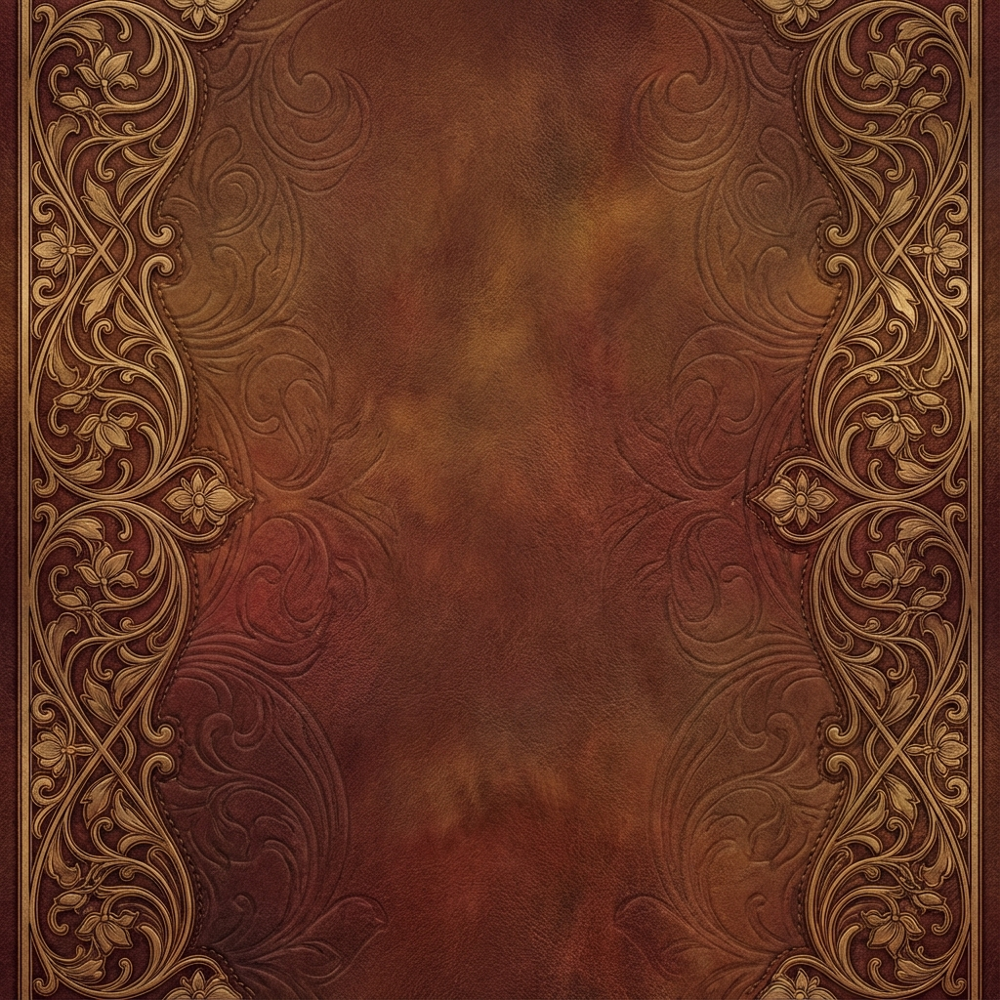

# Only Details Matter

An AI-powered creative experiment that explores the evolution of visual narratives through iterative detail discovery.

**[Live Demo →](https://only-details-matter.pages.dev)**



## 🎨 The Concept

**Only Details Matter** lets you provide an initial spark—a prompt or image—and watch as the AI creates a chain of images, each one picking a subtle detail from the previous image and weaving it into an entirely new scene.

It's like a visual game of telephone, where meaning transforms through the lens of the machine's creative obsession.

### 🔬 Research Study

This project is also a study to understand how generative models focus on details, select them, and use them across iterations. If you're interested in accessing the public data for research purposes, reach out on Twitter [@mandubian](https://twitter.com/mandubian).

## ⚙️ How It Works

1. **Begin**: Enter a text prompt or upload an image to start your evolution
2. **Generate**: The AI analyzes the image, picks an interesting detail, and creates a new scene featuring that detail
3. **Evolve**: Each turn, a new detail is discovered and transformed into a fresh narrative
4. **Fork**: Branch off at any turn to explore alternative evolutions
5. **Publish**: Share your threads to the public Exhibition for others to explore and fork

## 🔐 Privacy & API Keys

**Your API key stays with you.** API keys are stored only in your browser's local storage and are never transmitted to our servers. They are sent directly from your browser to Google's API endpoints.

Get your free Gemini API key at [Google AI Studio](https://aistudio.google.com/apikey).

## 📚 Features

- **Local Gallery**: Your threads are auto-saved to your browser's IndexedDB
- **Cloud Exhibition**: Publish and discover public threads
- **Forking**: Create your own branches from any thread or turn
- **Genealogy Tree**: Visualize the evolution lineage of your threads
- **Search**: Find threads by content or style
- **Multiple Styles**: Choose from 20+ artistic styles (Art Nouveau, Baroque, Cyberpunk, etc.)
- **Responsive Design**: Works on desktop and mobile devices

## 🚀 Getting Started

### Prerequisites

- Node.js 18+
- A Google Gemini API key

### Installation

```bash
# Clone the repository
git clone https://github.com/mandubian/details_matter.git
cd details_matter/details_matter_react

# Install dependencies
npm install

# Start the development server
npm start
```

Open http://localhost:3000 in your browser.

### Setting Your API Key

1. Click the **?** button in the gallery header to see the help page
2. In the settings panel (⚙️), enter your Gemini API key
3. The key is stored only in your browser's localStorage

## 🏗️ Architecture

```
details_matter_react/
├── src/
│   ├── components/     # React components (Gallery, Sidebar, Turn, etc.)
│   ├── services/       # Cloud service integration
│   ├── utils/          # AI integration, storage, image processing
│   └── index.css       # Art Nouveau-inspired styling
├── worker/             # Cloudflare Worker for cloud gallery
│   └── worker.js       # R2 storage + KV metadata
└── public/             # Static assets
```

### Tech Stack

- **Frontend**: React with hooks for state management
- **AI**: Google Gemini 2.0 Flash via @google/genai SDK (client-side)
- **Local Storage**: IndexedDB for threads, localStorage for settings
- **Cloud Storage**: Cloudflare R2 (blobs) + KV (metadata)
- **Styling**: Vanilla CSS with Art Nouveau aesthetic
- **Images**: Compressed to 720p WebP before storage

## ☁️ Cloud Gallery (Optional)

The app includes a public cloud gallery powered by Cloudflare Workers.

### Deploying Your Own Worker

1. Install Wrangler:
   ```bash
   npm install -g wrangler
   wrangler login
   ```

2. Create resources in Cloudflare Dashboard:
   - KV Namespace (e.g., `GALLERY_KV`)
   - R2 Bucket (e.g., `details-matter-v1`)

3. Configure `worker/wrangler.toml`:
   ```toml
   name = "details-matter-gallery"
   main = "worker.js"
   compatibility_date = "2024-01-01"

   [[kv_namespaces]]
   binding = "GALLERY_KV"
   id = "your-kv-id"

   [[r2_buckets]]
   binding = "GALLERY_BUCKET"
   bucket_name = "your-bucket-name"
   ```

4. Deploy:
   ```bash
   cd worker
   wrangler deploy
   ```

## 🔧 Troubleshooting

### API Key Issues
- Make sure your API key is valid and has proper permissions
- Check the browser console for error messages

### Image Generation Failures
- Some prompts may not generate images—try different wording
- Check your API quota/limits
- Try regenerating failed turns individually

### Geographic Restrictions
- Gemini image generation is only available in certain regions
- Check [Google AI availability](https://ai.google.dev/available_regions)

## 📄 License

Apache-2.0

## 🙏 Credits

Built with ❤️ using React, Gemini 2.0 Flash, Claude Opus 4.5, and Nano Banana.

The retro aesthetic is purposely inspired by Art Nouveau and tabletop card games—just for fun.

---

💡 If you have Google AI API credits to share (so users don't need their own keys), feel free to reach out on Twitter: [@mandubian](https://twitter.com/mandubian)

⚠️ The public demo is hosted on Cloudflare's free tier, so it may reach quota limits during high usage.
